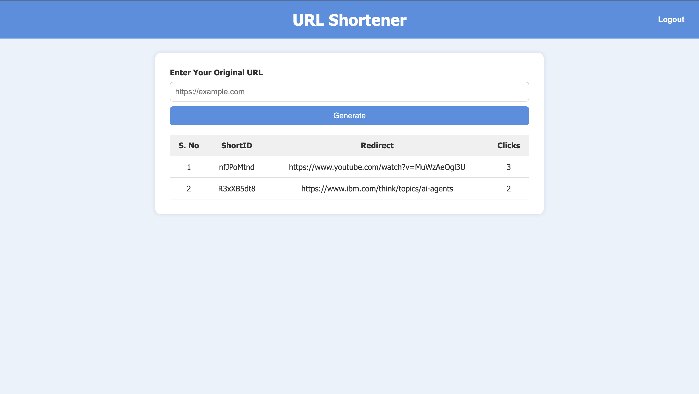
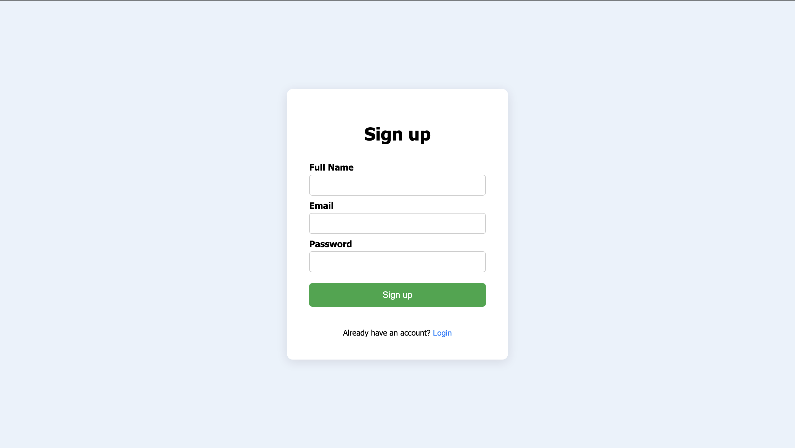
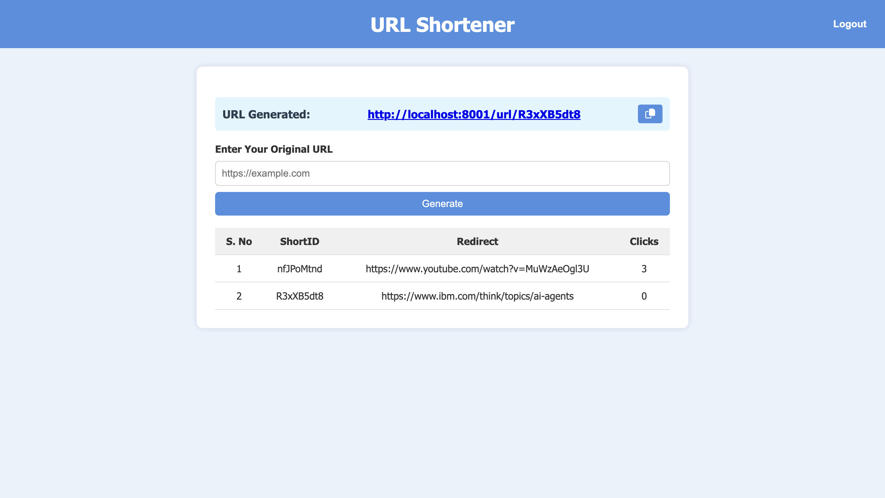

# 🔗 URL Shortener Web App

A full-stack web application that allows users to shorten long URLs, track click history, and manage their links with a user-friendly interface.

## 🚀 Features

- 🔒 User authentication (Signup/Login with password)
- ✂️ URL shortening with unique short IDs
- 📊 Click tracking for each short URL
- 🧑‍💻 Personalized dashboard to view all created URLs
- 📋 Copy to clipboard feature for shortened URLs

## 🛠 Tech Stack

- **Frontend**: HTML, CSS, JavaScript
- **Backend**: Node.js, Express.js
- **Database**: MongoDB
- **Authentication**: JWT (JSON Web Tokens)
- **Version Control**: Git, GitHub

## 📸 Screenshots

  
  
  
  

---

> Feel free to star ⭐ the repo if you found it useful!
